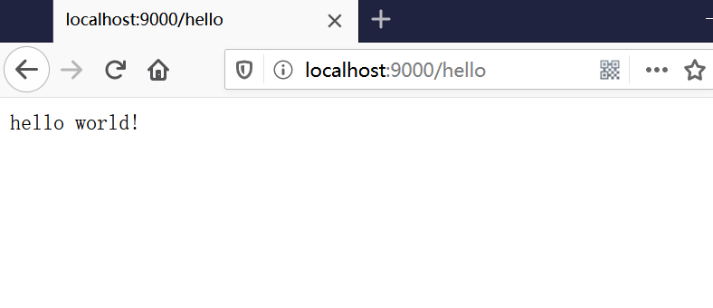
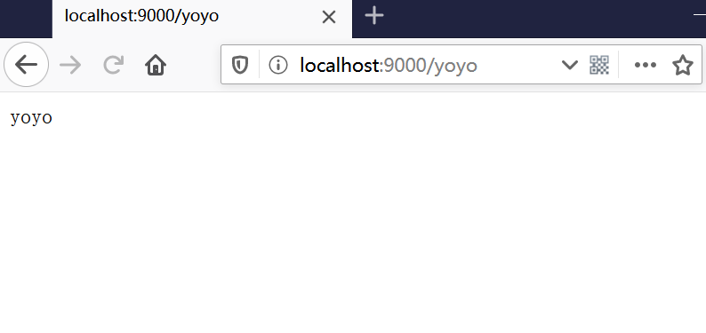
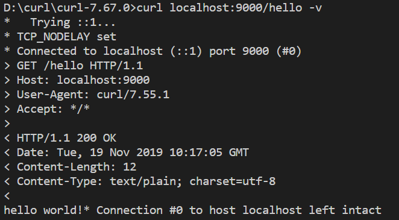
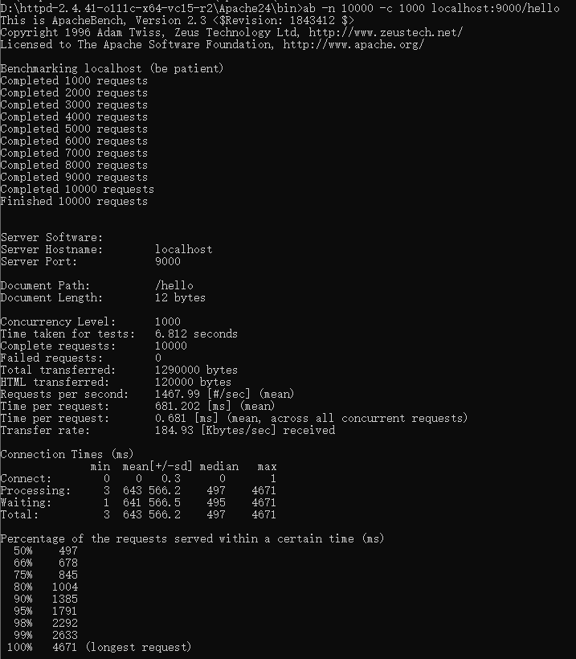

# 开发web服务程序

## 1.概述

开发简单 web 服务程序 cloudgo，了解 web 服务器工作原理。

## 2.任务目标

1. 熟悉 go 服务器工作原理
2. 基于现有 web 库，编写一个简单 web 应用类似 cloudgo。
3. 使用 curl 工具访问 web 程序
4. 对 web 执行压力测试

## 3.实验过程

### 编写web服务器

```go
package main

import (
	"fmt"
	"log"
	"net/http"
	"strings"
)

func sayhello(w http.ResponseWriter, r *http.Request) {
	r.ParseForm()
	fmt.Println(r.Form)
	fmt.Println("path", r.URL.Path)
	fmt.Println("scheme", r.URL.Scheme)
	fmt.Println(r.Form["url_long"])
	for k, v := range r.Form {
		fmt.Println("key:", k)
		fmt.Println("val:", strings.Join(v, ""))
	}
	fmt.Fprintf(w, "hello world!")
}

func sayyoyo(w http.ResponseWriter, r *http.Request) {
	fmt.Fprintf(w, "yoyo")
}

func main() {
	http.HandleFunc("/hello", sayhello)
	http.HandleFunc("/yoyo", sayyoyo)
	err := http.ListenAndServe(":9000", nil)
	if err != nil {
		log.Fatal("ListenAndServe:", err)
	}
}

```

### 浏览器访问

localhost:9000/hello



localhost:9000/yoyo



### 使用curl测试



### 使用ab测试




|                          参数                           |             含义             |
| :-----------------------------------------------------: | :--------------------------: |
|                     Server Hostname                     |         服务器主机名         |
|                       Server Port                       |          服务器端口          |
|                      Document path                      |           文件路径           |
|                     Document Length                     |           文件大小           |
|                    Concurrency Level                    |          并发量等级          |
|                  Time taken for tests                   |           测试时间           |
|                   Requests per second                   |        每秒处理需求数        |
| Percentage of the requests served within a certain time | 一定时间内处理的需求的百分比 |


